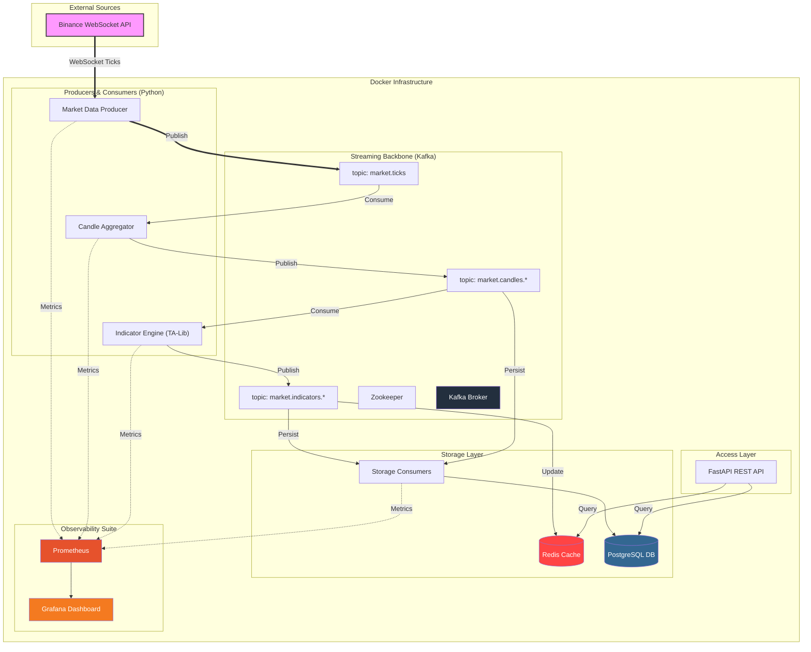

# Real-Time Crypto Market Data Streaming Pipeline

Event-driven pipeline that ingests trade data from Binance WebSocket, aggregates candles, computes technical indicators (SMA, EMA, RSI, VWAP) via TA-Lib, and materializes state into Redis and PostgreSQL. The system includes full observability with Prometheus and Grafana.

## 📊 Architecture



## 📋 Topics

| Topic | Description | Key |
|-------|-------------|-----|
| `market.ticks` | Raw trade events | symbol |
| `market.candles.1s` | 1-second OHLCV candles | symbol |
| `market.candles.1m` | 1-minute OHLCV candles | symbol |
| `market.indicators.realtime` | Indicators for Redis cache | symbol |
| `market.indicators.persisted` | Indicators for DB storage | symbol |

## 🛠️ Prerequisites

- Python 3.10+
- Docker & Docker Compose
- [TA-Lib C library](https://ta-lib.org/) installed on host

## ⚙️ Setup

```bash
# 1. Clone and install dependencies
git clone <repo-url> && cd event-driven-crypto-pipeline
pip install uv && uv sync

# 2. Start infrastructure (Kafka, Redis, Postgres, Prometheus, Grafana)
docker compose -f docker/docker-compose.yml up -d

# 3. Create Kafka topics
python -m scripts.create_topics

# 4. Configure environment
cp .env.example .env
# Edit .env (BTCUSDT, ETHUSDT, SOLUSDT, etc.)
```

## 🚀 Running

```bash
# Run the full pipeline (producer + all consumers + metrics server)
python main.py all

# Run specific components
python main.py run producer candle_1s indicators_1s cache

# Start the REST API
python main.py api --port 8000
```

## 📈 Observability

The system exports real-time metrics to **Prometheus** which are visualized in **Grafana**.

- **Grafana**: `http://localhost:3000` (Default: admin/admin)
- **Prometheus**: `http://localhost:9091`
- **Metrics Endpoint**: `http://localhost:9090/metrics` (Exposed by cada componente)

**Available Metrics:**
- `ticks_produced_total`: Number of trades ingested from Binance.
- `candles_produced_total`: Number of aggregated candles.
- `indicators_calculated_total`: Number of TA-Lib indicator calculations.
- `ws_connection_active`: Current WebSocket status.

## 📡 API Endpoints

| Method | Path | Source | Description |
|--------|------|--------|-------------|
| `GET` | `/health` | — | Health check |
| `GET` | `/indicators/{symbol}` | Redis | Latest indicator values |
| `GET` | `/indicators/{symbol}/history` | PostgreSQL | Historical indicator data |

## 📁 Project Structure

```
├── core/                  # Infrastructure layer (Metrics, DB, Cache, Kafka, Binance)
├── src/                   # Application layer (Producers, Consumers)
├── api/                   # REST API (FastAPI)
├── infra/                 # Infrastructure definitions
├── scripts/               # Operational utilities
├── tests/                 # Unit and integration tests
└── docker/                # Docker, Prometheus & Grafana config
```

## 🧰 Tech Stack

- **Streaming**: Apache Kafka (aiokafka)
- **Indicators**: TA-Lib (SMA, EMA, RSI, VWAP)
- **Cache**: Redis
- **Storage**: PostgreSQL (asyncpg)
- **API**: FastAPI
- **Observability**: Prometheus & Grafana
- **Package Manager**: uv
