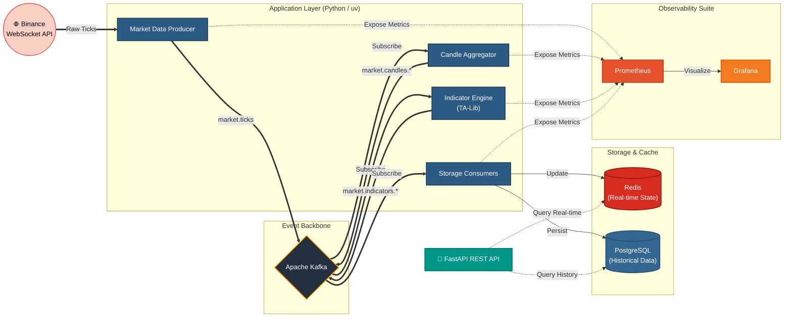

<div align="center">
  <h1>Real-Time Crypto Market Data Streaming Pipeline</h1>
  
  <p>
    
    
    
    
    
    
    
    
  </p>

  <p>
    <em>Event-driven pipeline that ingests trade data from Binance WebSocket, aggregates candles, computes technical indicators (SMA, EMA, RSI, VWAP) via TA-Lib, and materializes state into Redis and PostgreSQL. The system includes full observability with Prometheus and Grafana.</em>
  </p>
</div>

---

## 📖 Table of Contents

- [Architecture](#-architecture)
- [Project Structure](#-project-structure)
- [Prerequisites](#️-prerequisites)
- [Getting Started](#-getting-started)
- [API Endpoints](#-api-endpoints)
- [Kafka Topics](#-kafka-topics)
- [Observability](#-observability)

---

## 📊 Architecture



## 📁 Project Structure

```text
.
├── api/                   # REST API (FastAPI)
├── core/                  # Infrastructure layer (Metrics, DB, Cache, Kafka, Binance)
├── docker/                # Docker, Prometheus & Grafana config
├── infra/                 # Infrastructure definitions
├── scripts/               # Operational utilities
├── src/                   # Application layer (Producers, Consumers)
└── tests/                 # Unit and integration tests
```

## 🛠️ Prerequisites

- **Python 3.10+**
- **Docker & Docker Compose**
- **[TA-Lib C library](https://ta-lib.org/)** installed on your host machine

## 🚀 Getting Started

### 1. Clone and Install Dependencies

```bash
git clone <repo-url>
cd event-driven-crypto-pipeline

# Install and sync dependencies using uv
pip install uv
uv sync
```

### 2. Configure Environment

```bash
cp .env.example .env
# Edit .env with your specific configurations (e.g., BTCUSDT, ETHUSDT)
```

### 3. Start Infrastructure

Boot up Kafka, Redis, PostgreSQL, Prometheus, and Grafana via Docker Compose:

```bash
docker compose -f docker/docker-compose.yml up -d
```

### 4. Create Kafka Topics

Ensure all required topics are initialized:

```bash
python -m scripts.create_topics
```

### 5. Run the Application

You can start the various components of the pipeline using the main CLI:

```bash
# Run the full pipeline (producer + all consumers + metrics server)
python main.py all

# Or run specific components individually
python main.py run producer candle_1s indicators_1s cache

# Start the REST API on port 8000
python main.py api --port 8000
```

## 📡 API Endpoints

The FastAPI REST service provides the following endpoints to query the pipeline state:

| Method | Path | Source | Description |
| :--- | :--- | :--- | :--- |
| `GET` | `/health` | — | Health check and API status |
| `GET` | `/indicators/{symbol}` | Redis | Retrieve the latest indicator values (low latency) |
| `GET` | `/indicators/{symbol}/history` | PostgreSQL | Query historical indicator data |

## 📋 Kafka Topics

The data flow is decoupled through the following heavily-partitioned Kafka topics:

| Topic | Key | Description |
| :--- | :--- | :--- |
| `market.ticks` | `symbol` | Raw trade events ingested directly from Binance |
| `market.candles.1s` | `symbol` | 1-second OHLCV aggregated candles |
| `market.candles.1m` | `symbol` | 1-minute OHLCV aggregated candles |
| `market.indicators.realtime` | `symbol` | Calculated technical indicators bound for Redis |
| `market.indicators.persisted` | `symbol` | Calculated technical indicators bound for PostgreSQL |

## 📈 Observability

The system exports real-time prometheus metrics exposing the internals of the pipeline.

- **Grafana**: [`http://localhost:3000`](http://localhost:3000) (Default credentials: `admin` / `admin`)
- **Prometheus**: [`http://localhost:9091`](http://localhost:9091)
- **Metrics Endpoint**: `http://localhost:9090/metrics` 

### Available Metrics
- `ticks_produced_total`: Number of trades ingested from Binance.
- `candles_produced_total`: Number of aggregated candles.
- `indicators_calculated_total`: Number of TA-Lib indicator calculations.
- `ws_connection_active`: Current WebSocket status gauge.

---
<div align="center">
  <i>Built with ☕ and data engineering best practices.</i>
</div>
